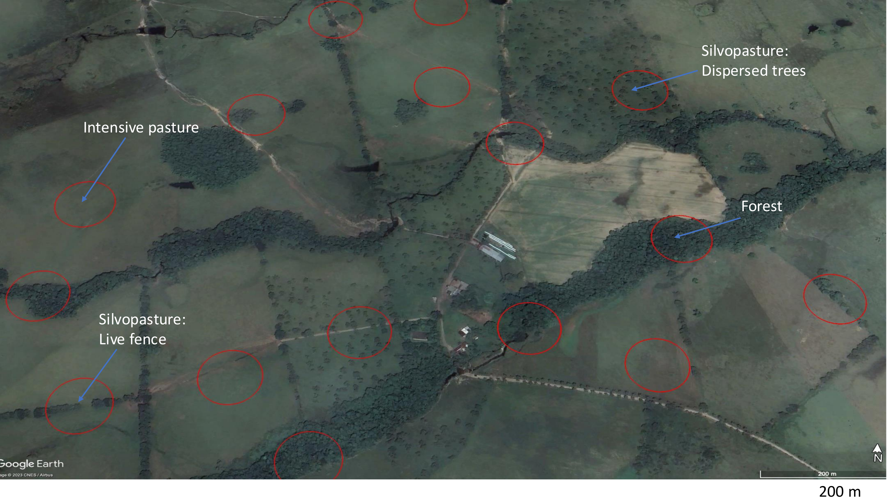

```{r}
#| label: Load-libraries

library(readxl)
library(tidyverse)
library(hms)
library(sf)
library(units)
library(cowplot)
library(png)
library(grid)
library(kableExtra)
```

```{r}
#| label: Load-data-and-fns

# Load in data 
Pc_locs_sf <- st_read("Derived/Geospatial/shp/Pc_locs.gpkg", quiet = TRUE)

path <- "DataS1"
File_names <- list.files(path)

Data <- map(File_names, \(sheet){
  read_csv(file = paste0(path, "/", sheet))
})
names(Data) <- str_remove(File_names, ".csv")

# Load functions
source("/Users/aaronskinner/Library/CloudStorage/OneDrive-UBC/Academia/Rcookbook/Themes_funs.R")

# Emit a table for whichever format is rendering. `latex_fn` receives the data frame and
# returns the kableExtra-styled LaTeX kable for the PDF; every other format (Word, HTML)
# gets a plain markdown table, which pandoc turns into a native table. `headers` sets the
# column names on the plain path (LaTeX headers are handled inside latex_fn).
dual_table <- function(df, headers = names(df), latex_fn) {
  if (knitr::is_latex_output()) return(latex_fn(df))
  if (is.function(headers)) headers <- headers(names(df))
  knitr::kable(df, col.names = headers)
}

# Give LaTeX table columns fixed widths (cm; NA = natural width) and centre every cell vertically. Pair with kable(align = table_align(...)) so cells are also centred horizontally, except long-text Description / Definition columns, which stay left-aligned (house style for all tables).
table_align <- function(col_names) if_else(col_names %in% c("Description", "Definition"), "l", "c")
set_col_widths <- function(kbl, widths) {
  reduce(seq_along(widths), \(tbl, i) {
    if (is.na(widths[i])) tbl else column_spec(tbl, i, width = paste0(widths[i], "cm"), latex_valign = "m")
  }, .init = kbl)
}
```

```{r}
#| label: insert-num-objs

Num_obs <- nrow(Data$Bird_pcs_all)
Num_obs_prty <- prettyNum(Num_obs, big.mark = ",")
Num_sites <- nrow(Data$Site_covs)
Num_spp <- length(unique(Data$Bird_pcs_all$Species_ayerbe))   # species recorded, matching Num_obs (Bird_pcs_all); the analysis subset has fewer
Num_fam <- length(unique(Data$Taxonomy$Family))
Tot_pc <- nrow(Data$Event_covs)
Tot_pc_prty <- prettyNum(Tot_pc, big.mark = ",")
Num_ft <- Data$Functional_traits %>%
  select(-any_of("Species_ayerbe")) %>%
  ncol()
Num_farms <- unique(Data$Site_covs$Id_scr) %>% length()
Num_datasets <- n_distinct(Data$Event_covs$Uniq_db)
Year_first <- min(Data$Event_covs$Year)
Year_last <- max(Data$Event_covs$Year)

# Crop locations: too few to list as a sampled habitat in the dataset overview table, so the table caption reports them instead
Crop_locs <- Data$Site_covs %>%
  filter(Habitat == "Cultivos") %>%
  left_join(distinct(Data$Event_covs, Id_survey_no_dc, Uniq_db), by = "Id_survey_no_dc") %>%
  count(Uniq_db)
Crop_locs_txt <- str_c(Crop_locs$n, " ", Crop_locs$Uniq_db, collapse = ", ")
# Caption of the dataset overview table (built here because it reports the computed crop counts)
Tbl_datasets_cap <- paste0('Overview of the datasets, ordered by first survey year. Each dataset is one data collector\'s survey campaign, named as in the `Uniq_db` column of `Event_covs.csv`. CIPAV = Centro para la Investigación en Sistemas Sostenibles de Producción Agropecuaria; GAICA = Asociación GAICA; Unillanos = Universidad de los Llanos; UBC = University of British Columbia. Locations are unique point count locations and surveys are point counts (a location surveyed on several visits counts once per visit). Habitats are the dominant land cover within the point count radius. CIPAV\'s duration is the span between the first and last bird recorded, since they extended counts when few birds were detected; every other dataset used a fixed 10-minute count. GAICA distancia used no fixed radius; observers estimated the distance to each bird. Crops are omitted from Habitats: only ', sum(Crop_locs$n), ' locations were in crops (', Crop_locs_txt, ').')

# Visits per physical location, pooled across data collectors -- the Event_covs 'N_reps' column counts repeats per Id_survey (one collector's point count) and so tops out lower than this
Visits_per_loc <- Data$Event_covs %>% count(Id_survey_no_dc, name = "n_visits")
Max_visits_loc <- max(Visits_per_loc$n_visits)

# Locations with >= 3 repeat surveys inside one closed sampling period.
# Per_three_plus_loc = share of all locations (matches the abstract); Per_three_plus = share of non-CIPAV point counts (Research methods, since CIPAV was surveyed once).
Per_three_plus_loc <- Data$Event_covs %>%
  slice_max(order_by = Rep_season, by = Id_survey_no_dc, with_ties = FALSE) %>%
  summarise(pct = round(mean(Rep_season >= 3) * 100)) %>% pull(pct)
Max_pcs_per_season <- Data$Event_covs %>%
  filter(Institution_name != "Cipav") %>%
  slice_max(order_by = Rep_season, by = Id_survey)
Per_three_plus <- round(nrow(filter(Max_pcs_per_season, Rep_season >= 3)) / nrow(Max_pcs_per_season) * 100, 1)
```

# Introduction

Agriculture occupies approximately half of the world’s habitable land surface, and has resulted in extensive forest destruction, fragmentation, and the endangerment of biodiversity [@kennedyManagingMiddleShift2019; @lewisIncreasingHumanDominance2015; @hald-mortensenMainDriversBiodiversity2023]. One way of ameliorating agriculture’s impact on earth’s natural systems is through ecological intensification, which combines traditional ecological knowledge with scientific innovation to reduce external inputs, improve/maintain productivity, and conserve biodiversity [@altieriLinkingEcologistsTraditional2004; @kremenEcologicalIntensificationDiversification2020; @kremenDiversifiedFarmingSystems2012]. A swift transition to diversified agricultural systems is particularly important in the hyper-biodiverse Neotropics (i.e. new-world tropics), where biodiversity is declining faster than anywhere in the world, and agriculture is the primary threat [@almondLivingPlanetReport2022; @antonelliRiseFallNeotropical2022]. Monoculture grass pasture, in particular, is the dominant anthropogenic land cover in the Neotropics [@faoFAOSTAT2020]; thus, management of pastoral lands will determine the fate of much of tropical biodiversity [@calleStrategyScalingUpIntensive2013; @murgueitioNativeTreesShrubs2011; @mendenhallCountrysideBiogeography2013].

Implementing silvopastoral systems—an agroforestry technique involving the incorporation of trees and shrubs in pastoral landscapes—on lands previously converted to grass pasture may play an important role in slowing biodiversity declines. Indeed, by adding botanical and structural diversity to the landscape, silvopasture may facilitate movement [@kremenLandscapesThatWork2018], buffer species from the effects of fragmentation [@arroyo-rodriguezDoesForestFragmentation2017; @ewersFragmentationImpairsMicroclimate2013], and increase species persistence in fragmented landscapes. Colombia offers a salient example within the Neotropics of a country with extremely high levels of biodiversity that are gravely threatened by agriculture [@murciaConservingBiodiversityComplex2013; @etterRegionalPatternsAgricultural2006]. Pastureland (and feed crops for cattle) has a particularly large impact as the predominant anthropogenic land use in the country, occupying \~30% of the country’s land cover [@williamsMinimisingLossBiodiversity2020; @vanausdalPastureProfitPower2009; @lernerSustainableCattleRanching2017]. Over the past several decades, various organizations in Colombia have implemented projects to introduce silvopasture as one method for rehabilitating degraded pastures in Colombia. Implementation of silvopasture will also be critical in meeting sustainability, production, climate, and conservation goals [@tapascoLivestockSectorColombia2019; @fedeganCifrasReferenciaSector2018].

Bird communities in agricultural landscapes are structured by processes operating at multiple spatial scales, including local habitat characteristics, landscape composition, habitat connectivity, and regional climate conditions <!-- CK: cite? -->. The local agricultural management practices are important as they greatly influence resource and niche space availability, predominantly through the vegetative cover and structural diversity <!-- CK: cite? -->. For example, agrobiodiversity can range from homogenous monocultures to highly diversified polycultures, management can be minimally or highly disruptive (e.g., mowing, tilling, harvesting), and pests can be controlled by leveraging ecosystem services or through the application of pesticides [@stantonAnalysisTrendsAgricultural2018]. Past work in silvopastoral systems has found greater taxonomic diversity compared to monoculture pasture, but less than forested habitat [@mendozaConsistencyBirdUse2014; @auspreySensitivityTropicalMontane2023], although there are exceptions reporting equivalent or higher levels of diversity in silvopasture relative to forest patches [@broomSustainableEfficientLivestock2013; @prevedelloImportanceScatteredTrees2018]. Furthermore, the impact of local management is likely moderated by climatic conditions like temperature and rainfall, as bird affiliation with agricultural systems tends to be greater in cooler / wetter environments [@frishkoffClimateChangeHabitat2016; @boyleHygricNichesTropical2020; @soberonGrinnellianEltonianNiches2007]. Given these complexities, our understanding of silvopasture's impact on bird biodiversity is limited by studies with small spatiotemporal and taxonomic coverage.

Here we present the 'Bird diversity in cattle ranching landscapes of Colombia' dataset, which collates and standardizes data across `r Tot_pc_prty` surveys conducted at `r Num_sites` unique point count locations from `r Year_first` to `r Year_last`, drawn from `r Num_datasets` datasets (@tbl-datasets). We recorded `r Num_obs_prty` bird observations of `r Num_spp` species in `r Num_fam` families across five ecologically distinct regions (hereafter, ‘ecoregions’), including tropical dry forest, Andean montane forest, and the plains of the Orinoco river basin (@fig-sampling-map). The most speciose orders were Passeriformes, Apodiformes, Piciformes, Psittaciformes, and Accipitriformes (@fig-phylogeny), and the species that were both widespread and abundant tended to thrive in highly dynamic and heterogeneous landscapes (e.g., *Tyrannus melancholicus, Cyanocorax violaceus, Bubulcus ibis, Milvago chimachima,* and *Crotophaga ani*; @fig-abund-widespread-spp).

```{r}
#| label: tbl-datasets
#| tbl-cap: !expr Tbl_datasets_cap

# Fixed point count radius (m) of each dataset's protocol (see Research methods); GAICA distancia had no fixed radius, only an estimated distance to each bird
Dataset_radius <- c("Cipav mbd" = "25", "Gaica mbd" = "50", "Gaica distancia" = "–",
                    "Unillanos mbd" = "50", "Ubc mbd" = "50", "Ubc gaica mbd" = "50")

# Collapse a set of years into runs, e.g. 2013, 2014, 2016, 2017 -> "2013–14, 2016–17"
collapse_years <- function(years) {
  years <- sort(unique(years))
  runs <- split(years, cumsum(c(1, diff(years) != 1)))
  map_chr(runs, \(r) if (length(r) == 1) as.character(r) else paste0(min(r), "–", max(r) %% 100)) %>%
    str_c(collapse = ", ")
}

Covs_join <- Data$Event_covs %>%
  left_join(Data$Site_covs[c("Id_survey_no_dc", "Id_scr", "Habitat", "Ecoregion")], by = "Id_survey_no_dc") %>%
  mutate(
    Ecoregion = case_match(Ecoregion, "Cafetera" ~ "Coffee region", "Cordillera oriental" ~ "Cordillera Oriental",
                           "Bajo magdalena" ~ "Bajo Magdalena", "Rio cesar" ~ "Río Cesar", .default = Ecoregion),
    Habitat = factor(Habitat, levels = c("Bosque", "Ssp", "Pastizales", "Mosaic", "Cultivos"),
                     labels = c("forest", "silvopasture", "pasture", "mosaic", "crops"))
  )
Num_ecor <- n_distinct(Covs_join$Ecoregion)

Dataset_tbl <- Covs_join %>%
  summarise(
    First_year = min(Year),
    Years = collapse_years(Year),
    Ecoregions = if (n_distinct(Ecoregion) == Num_ecor) "All five" else str_c(sort(unique(Ecoregion)), collapse = ", "),
    Habitats = str_c(sort(unique(Habitat[Habitat != "crops"])), collapse = ", ") %>% str_to_sentence(), # crops (a handful of locations) are reported in the caption instead
    Farms = n_distinct(Id_scr),
    Locations = n_distinct(Id_survey_no_dc),
    Surveys = n(),
    # Duration: CIPAV's counts vary in length (Pc_duration); the rest are a fixed 10 minutes
    Min_dur = round(as.numeric(min(Pc_duration, na.rm = TRUE)) / 60),
    Max_dur = round(as.numeric(max(Pc_duration, na.rm = TRUE)) / 60),
    .by = Uniq_db
  ) %>%
  mutate(
    Radius = Dataset_radius[Uniq_db],
    Duration = if_else(Min_dur == Max_dur, as.character(Min_dur), paste0(Min_dur, "–", Max_dur)),
    Surveys = prettyNum(Surveys, big.mark = ",")
  ) %>%
  arrange(First_year, Uniq_db) %>%
  select(Dataset = Uniq_db, Years, Ecoregions, Habitats, Farms, Locations, Surveys, Radius, Duration)

# Every column gets a fixed width (cm) so long cells wrap; small font and tight column padding keep nine columns inside the text block
Dataset_widths <- c(1.9, 1.6, 2.3, 3.0, 0.9, 1.3, 1.1, 1.1, 1.3)
dual_table(
  Dataset_tbl,
  headers = c("Dataset", "Years", "Ecoregions", "Habitats", "Farms", "Locations", "Surveys", "Radius (m)", "Duration (min)"),
  latex_fn = \(d) {
    out <- d %>%
      kable("latex", booktabs = TRUE, longtable = TRUE, align = "c",
            col.names = c("Dataset", "Years", "Ecoregions", "Habitats", "Farms", "Locations", "Surveys", "Radius (m)", "Duration (min)")) %>%
      kable_styling(latex_options = c("striped", "hold_position"), position = "center", font_size = 9)
    out <- set_col_widths(out, Dataset_widths)
    # Tighter column padding for this table only, restored to the LaTeX default (6pt) afterwards
    structure(paste0("\\setlength{\\tabcolsep}{3pt}\n", out, "\n\\setlength{\\tabcolsep}{6pt}"), format = "latex", class = "knitr_kable")
  }
)
```

![`r Num_sites` point count locations surveyed across `r Num_farms` farms in `r Num_ecor` ecoregions of Colombia. Symbol shape shows the data collector, and symbol size the number of point count locations each data collector surveyed within a quarter-degree grid cell. Dashed outlines enclose each ecoregion's sampling locations. Where several data collectors surveyed the same cell, their symbols are spaced evenly around the cell centre so that none hides another. The densely sampled Piedemonte (solid box) is enlarged at bottom right, where symbols summarize finer grid cells (0.05°, about 5.5 km) on the same size scale. Colombia is extremely topographically diverse: the Andes trifurcate into three distinct chains ('cordilleras'), separated by the Cauca and Magdalena river valleys, and more isolated 'sierras' (e.g., Sierra Nevada de Santa Marta) are an important determinant of bird distributions. Major rivers also run off the eastern slope of the Andes into the plains and eventually into the Orinoco and Amazon rivers. Background shading shows elevation on a log scale to emphasize relief at lower elevations. The upper-right inset locates the map (red box) in northern South America.](../../../Figures/Map_sampling/Sampling_map.png){#fig-sampling-map}

The `r Num_sites` point count locations were each surveyed 1–`r Max_visits_loc` times (`r Tot_pc_prty` surveys in total, pooled across data collectors), and `r Per_three_plus_loc`% were sampled $\geq$ 3 times within a closed sampling period (nearly all of the point counts other than CIPAV's, which were surveyed once), enabling estimation of detection probabilities through hierarchical occupancy models. Land-use landcover types surveyed include mature forest, forest fragments, riparian forest, crops, intensive pasture, several types of silvopasture, and heterogeneous mosaics (i.e., no single dominant landcover type). This dataset permits analyses of bird diversity patterns and community composition across land-use gradients, especially the effects of silvopastoral practices on biodiversity in tropical cattle ranching landscapes. We also provide complementary datasets of taxonomic equivalents (BirdLife, BirdTree, and eBird / Clements), functional traits, site covariates, and survey covariates (@tbl-file-info), facilitating a variety of research questions and analytical approaches. For example, one could examine the interacting effects of local management practices and climate, while controlling for phylogenetic non-independence, to understand silvopasture's influence on functional diversity and ecosystem service provisioning. Importantly, the repeated sampling of many locations across years also enables analyses of temporal changes in occupancy, colonization, extinction dynamics, and community turnover [@leesRoadmapIdentifyingFilling2020].

{#fig-phylogeny}

```{r}
#| label: tbl-file-info
#| tbl-cap: File names, number of observations per .csv file, and their size in megabytes. 

# Specify the path to the directory
directory_path <- "DataS1" # Replace with your actual directory path

# Get information about all files and extract the size of each file
file_info <- file.info(list.files(path = directory_path, full.names = TRUE))
file_sizes <- file_info$size

# Short descriptions of each file 
Short_descriptions <- tibble(
  File_name = c("Bird_pcs_all.csv", "Bird_pcs_analysis.csv", "Event_covs.csv", "Functional_traits.csv", "Site_covs.csv", "Taxonomy.csv"),
  Description =  c("All point count observations", "Subset of ‘Bird_pcs_all.csv’ (see 'Scripts/06_Analysis_wrangling.R')", "Information about each survey, including date, start time, and detection covariates", "Functional traits of all species observed in the project", "Unchanging covariates of each point count location", "Taxonomic equivalents including BirdLife, BirdTree, and eBird/Clements")
)

# Number of observations in each data set
Num_obs_vec <- map_chr(Data, \(df){
  nrow(df) %>% base::prettyNum(big.mark = ",")
})

# Combine in tibble 
file_names_and_sizes <- tibble(
  File_name = basename(rownames(file_info)),
  Number_obs = Num_obs_vec,
  Size_MB = round(file_sizes / 1e6, 2)
) %>% inner_join(Short_descriptions) %>%   # keep only the documented deposit tables (drops the .xlsx / manifest)
  arrange(desc(Size_MB)) %>%
  relocate(Description, .after = File_name)

# Print and format
## A "\n" in a LaTeX header is not a line break -- kableExtra::linebreak() wraps it in \makecell (the makecell package is loaded in the qmd preamble); escape = FALSE is then required, so the underscores in File name / Description are pre-escaped
dual_table(
  file_names_and_sizes,
  headers = c("File name", "Description", "Number of observations", "Size (MB)"),
  latex_fn = \(d) d %>%
    mutate(across(c(File_name, Description), ~str_replace_all(.x, "_", "\\\\_"))) %>%
    kable("latex", booktabs = TRUE, longtable = TRUE, escape = FALSE,
          align = table_align(names(d)),
          col.names = kableExtra::linebreak(c("File name", "Description", "Number of\nobservations", "Size (MB)"), align = "c")) %>%
    kable_styling(latex_options = c("striped", "hold_position"), position = "center") %>%
    set_col_widths(c(NA, 8))
)
```

{#fig-abund-widespread-spp}

# Class I. Data Set Descriptors

## A. Data set identity:

Bird diversity in cattle ranching landscapes of Colombia

## B. Data set identification code: Bird_pcs_all.csv

## C. Data set description

### Originators:

Names and address of principal investigators associated with data set

Tomas Walschburger, Diego J. Lizcano\
The Nature Conservancy, Bogota, Colombia

### D. Key words/phrases:

Location (spatial scale), time period and sampling frequency (temporal scale), theme or contents (thematic scale)

Colombia, Bajo Magdalena, Cafetera, Río Cesar, Piedemonte, Cordillera Oriental, 2013 - 2026, longitudinal data

# Class II. Research origin descriptors

## A. Overall project description:

*\[Note: This section may be essential if data set represents a component of a larger or more comprehensive database; otherwise, relevant items may be incorporated into II.B.\]*

1.  Identity: This data set was been collected during two long-term international initiatives, the Sustainable Cattle Ranching (SCR) and the Science for Nature and People Partnership (SNAPP) projects.

2.  Originators: Names and addresses of principal investigators associated with project\
    \
    Tomas Walschburger, Manuel Gómez Vivas, Julián Chará, Christina Kennedy, Juliana Delgado\
    COLLABORATORS - Provide address

3.  Period of study: Date commenced, date terminated, or expected duration\
    \[2013-2026\]

4.  Objectives: Scope and purpose of research program\
    \
    The SCR project (2012-2019) and the subsequent SNAPP project (2022 - 2026) monitored biodiversity, carbon, farm productivity, and the socioeconomic status of farmers that adopted silvopasture in Colombia. The specific objectives were to: 1) Understand the impacts of silvopastoral systems (SPS) on biodiversity, climate, productivity, and farmer wellbeing; 2) Identify conditions for synergies (win-win situations) for people and nature; 3) Evaluate real-world drivers of on-farm adoption and better understand enablers and constraints; 4) Develop evidence-based guidance for environmental certification standards and advance a diagnostic tool for sustainable cattle ranching partners.

5.  Abstract: Descriptive abstract summarizing broader scientific scope of overall research project\
    \
    By 2050, global demands for livestock products (milk and meat) are estimated to increase by more than 50%, and correspondingly, cattle production in Latin America could increase by 125%. How this growth occurs has significant social, economic, and environmental consequences. Extensive pasture monoculture is the dominant livestock grazing system in Latin America and is environmentally damaging and vulnerable to climate change. It has led to habitat conversion, biodiversity loss, degraded soils and water quality, and increased greenhouse gas emissions. Silvopastoral Systems – the intentional incorporation of trees and shrubs in grazing lands – are a promising alternative to reduce the environmental footprint of pasture monocultures and enhance productivity and climate benefits to farmers and society. With the aim of understanding silvopasture’s impacts on multifunctional outcomes including biodiversity, carbon, farm productivity, and the socioeconomic status of farmers, the SCR and SNAPP projects worked on 4,100 farms across five ecoregions of Colombia from 2012-2026. Through technical assistance and provision of materials, the project transformed \~160,000 hectares of farms with degraded pasture to silvopasture, primarily by integrating live fences and dispersed trees. Preliminary analyses show the potential for win-win outcomes for people and nature. However, silvopasture has rarely been adopted outside of international development projects, and its potential for scaling is poorly understood.

6.  Sources of funding: Grant and contract numbers, names, and addresses of funding sources\
    \
    This work was funded through the Mainstreaming Sustainable Cattle Ranching project: Global Environment Facility (GEF) Trust Fund grant TF-96465, and World Bank grant P104687.

## B. Specific subproject description

### Site description

- Site type: Descriptive (e.g., short-grass prairie, blackwater stream, etc.)\
  \
  Sampling was conducted in five broad ecoregions: the coffee region (the central Andes), the Cordillera Oriental (the Eastern Andes), Piedemonte (Orinoco piedmont), Bajo Magdalena (lower basin of the Magdalena River), and Río Cesar (Cesar river basin) (@fig-sampling-map). Colombia is a tropical country with extreme topographic complexity but little temperature variation throughout the year. Thus, climate and seasonality are primarily defined by elevation and rainfall patterns (@fig-envi-boxplots). Rainfall is unimodal closer to the equator (e.g., sites in the Piedemonte region are closer to unimodal) and generally bimodal further from the equator (@fig-prec-smooth), although local topography complicates these patterns.

{#fig-envi-boxplots}

[The Andes:]{.underline} The coffee region and Cordillera Oriental ecoregions reside in the Andes, a region defined by complex mountain topography, highly regional microclimates, and extreme elevational and climatic gradients over short geographic distances. The Andes trifurcate in Colombia into three distinct ranges or 'cordilleras' and two major intermontane valleys, the Cauca Valley between the Western and Central cordilleras, and the Magdalena Valley between the Central and Eastern cordilleras. The eastern slopes of the cordilleras tend to be wetter than the western slopes (although the western side of the westernmost cordillera is an exception due to the extreme humidity from the Pacific Ocean characteristic of the Chocó region), and there are small rain shadows at lower elevations at the bottom of the valleys. Topographic complexity and highly regional microclimates have resulted in high bird diversity, including a large influx of migrants in the northern hemisphere's winter months. Note that sites in the coffee region span both the Magdalena and Cauca river valleys, as well as the Central cordillera; sites in the Cordillera Oriental are only in the East Andean highlands.\
[Piedemonte:]{.underline} On the East side of the Eastern-most chain of the Andes is the 'Piedemonte' (piedmont or foothills) region, a complex transition zone between the Andes and the flat plains (i.e. los Llanos) to the East. Heavy rainfall on the Eastern slope of the Andes results in many rivers and gallery forests dissecting the landscape as they flow East towards the grassland plains of the upper Orinoco River basin and south towards the Amazon rainforest biome. Little forest remains and cattle ranching is the predominant agricultural activity of the region. The birds of the Piedemonte are quite diverse as it is a mix of Andean and Llanos birds, with some widespread Amazonian birds reaching our sampling sites.\
[Bajo Magdalena:]{.underline} This region is near the delta of the Magdalena River in the Caribbean. The region is dry, particularly the windswept coastal regions, although it gets wetter further inland. Vegetation is dominated by short stature trees that drop their leaves (tropical dry forest) and desert-like scrub. [\
Río Cesar:]{.underline} A dry river valley nestled between the Sierra Nevada de Santa Marta (the world's tallest isolated coastal mountain range) and the Serranía del Perijá mountains that straddle the Colombia-Venezuela border. The vegetation is similar to the Bajo Magdalena region. High temperatures and low precipitation result in desert conditions, with scrubby acacia-like trees and large cacti dominating the vegetation. This unique region has relatively high endemism, sharing some species only with similar desert areas in neighboring Venezuela.

{#fig-prec-smooth width="700"}

- Geography: Location (e.g., latitude/longitude), size

```{r}
#| label: Geo-extent

Pc_locs_sf %>% st_bbox() 
```

```{r}
#| label: mcp-study-area

# Custom function to convert to mcp & calculate area
calc_km2 <- function(sf_obj, group = NULL) {
  group <- rlang::enquo(group)

  if (rlang::quo_is_null(group)) {
    sf_obj <- sf_obj %>% mutate(group = "All")
    group <- rlang::sym("group")
  }

  sf_obj %>%
    group_by( {{ group }} ) %>%
    summarise(geometry = st_union(geom), .groups = "drop") %>%
    st_convex_hull() %>%
    st_transform(crs = st_crs("EPSG:32618")) %>%
    mutate(Area = set_units(st_area(.), km^2) |> drop_units()) %>%
    st_drop_geometry() %>% 
    mutate(Area = round(Area, 0))
}

# Study area
area_km2_all <- calc_km2(Pc_locs_sf) # Total
area_km2_ecor <- calc_km2(Pc_locs_sf, group = Ecoregion) # By ecoregion
```

```{r}
#| label: tbl-elev
#| tbl-cap: The departments that make up each ecoregion, and the minimum (Min) and maximum (Max) elevations (m), the elevational range (m), and the area (km²) of bird sampling locations in each ecoregion.

Data$Site_covs %>%
  summarize(Min = min(Elev, na.rm = TRUE),
            Max = max(Elev, na.rm = TRUE),
            Range = Max - Min,
            .by = Ecoregion) %>%
  left_join(area_km2_ecor) %>%
  # Departments: ecoregions are project-defined groupings of departments (01_Gen_wrangling.R), so list the members to define each one; restore the accents the pipeline strips
  left_join(
    Data$Site_covs %>%
      distinct(Ecoregion, Department) %>%
      mutate(Department = case_match(Department,
        "Atlantico" ~ "Atlántico", "Bolivar" ~ "Bolívar", "Boyaca" ~ "Boyacá",
        "Quindio" ~ "Quindío", "Valle del cauca" ~ "Valle del Cauca", "Guajira" ~ "La Guajira",
        .default = Department)) %>%
      summarize(Departments = str_c(sort(Department), collapse = ", "), .by = Ecoregion)
  ) %>%
  # Ecoregion: Spanish primary name; Description: English descriptor (see the ecoregion list in the site description)
  mutate(
    Description = case_match(Ecoregion,
      "Cafetera"            ~ "Central Andes and surrounding river valleys",
      "Cordillera oriental" ~ "East-Andean Highlands",
      "Piedemonte"          ~ "East-Andean piedmont, transition to Orinoquian plains",
      "Bajo magdalena"      ~ "Lower Magdalena Basin",
      "Rio cesar"           ~ "Cesar river valley"
    ),
    Ecoregion = case_match(Ecoregion,
      "Cafetera"            ~ "Coffee region",
      "Cordillera oriental" ~ "Cordillera Oriental",
      "Piedemonte"          ~ "Piedemonte",
      "Bajo magdalena"      ~ "Bajo Magdalena",
      "Rio cesar"           ~ "Río Cesar"
    )
  ) %>%
  relocate(Description, Departments, .after = Ecoregion) %>%
  arrange(Range) %>%
  dual_table(latex_fn = \(d) d %>%
    kable("latex", booktabs = TRUE, longtable = TRUE, escape = FALSE, align = table_align(names(d))) %>%
    kable_styling(latex_options = c("striped", "hold_position"), position = "center") %>%
    set_col_widths(c(NA, 4, 3.6))
  )
```

Our study area covered nearly 8$^{\circ}$ of latitude, 3.5$^{\circ}$ of longitude, and `r format(round(as.numeric(area_km2_all$Area)), big.mark = ",")` $\text{km}^2$. See @tbl-elev for the area (the convex hull) of bird sampling locations in each ecoregion.

Habitat: Detailed characteristics of habitats sampled

```{r}
#| label: Hab-tbls

# Count point count locations per habitat class; habitat restricts the count to one Habitat so sub-habitat counts sum to that habitat's total
Create_hab_tbl <- function(col, habitat = NULL){
  Data$Site_covs %>% 
  filter(is.null(habitat) | Habitat %in% habitat) %>%
  distinct(Id_survey_no_dc, {{ col }}) %>%
  count( {{ col }}) %>%
  pivot_wider(names_from = {{ col }}, values_from = n) %>% 
  Cap_snake()
}

Hab_tbl <- Create_hab_tbl(col = Habitat)
Hab_forest_tbl <- Create_hab_tbl(col = Habitat_sub, habitat = "Bosque")
Hab_ssp_tbl <- Create_hab_tbl(col = Habitat_sub, habitat = "Ssp")

# Where the mature-forest locations are (Otún Quimbaya = "OQ_", Reserva El Hatico = "EH_" in Id_survey_no_dc)
Maduro_locs <- Data$Site_covs %>% filter(Habitat_sub == "Maduro")
N_maduro_cafetera <- sum(Maduro_locs$Ecoregion == "Cafetera")
N_maduro_oq <- sum(str_detect(Maduro_locs$Id_survey_no_dc, "OQ_"))
N_maduro_eh <- sum(str_detect(Maduro_locs$Id_survey_no_dc, "EH_"))
N_maduro_pdm <- sum(Maduro_locs$Ecoregion == "Piedemonte")

#Pc_hab %>% filter(Habitat_sub == "Maduro") %>% view()
```

`r Tot_pc_prty` point counts were conducted in five primary habitats (e.g. forest) and eight sub-habitat types (e.g., riparian forest). After each primary habitat or sub-habitat type we list the number of unique point count locations (n):

- Forest (Total n = `r Hab_tbl$Bosque` point counts)

  - Forest fragments (n = `r Hab_forest_tbl$Secundario`): Small fragments embedded in cattle ranching landscapes. Forest fragments were generally \< 5 ha, although many were connected to other forested elements in the landscape. Surveys were conducted on the forest edge, either inside the forest (\<50 m from the edge) or just outside the forest (\<15 m outside the forest), although this was not recorded systematically.

  - Riparian forest (n = `r Hab_forest_tbl$Ripario`): Gallery forests on either side of a stream or river

  - Mature forest (n = `r Hab_forest_tbl$Maduro`): Taller, older, and larger contiguous forests. `r N_maduro_cafetera` of these points were in the Cafetera ecoregion (`r N_maduro_oq` in the ecological reserve Otún Quimbaya, `r N_maduro_eh` in Reserva El Hatico) and `r N_maduro_pdm` were in a large forest in the Piedemonte.

- Silvopasture (Total n = `r Hab_tbl$Ssp`): Silvopastoral systems consist of a variety of practices and range across a spectrum regarding the diversity and intensity of practices implemented. For example, silvopastural systems can be tree (and grass) combinations planted to be homogeneous in spacing and age, or, alternatively, they can be highly diverse polycultures composed of remnant vegetation and naturally recruited tree species [@cubbageComparingSilvopastoralSystems2012]. See @murgueitioNativeTreesShrubs2011, @calleStrategyScalingUpIntensive2013, and @cubbageComparingSilvopastoralSystems2012 to better understand the full extent of management practices that can be incorporated in silvopastoral systems. In our bird sampling efforts, the project differentiated between several types of silvopasture:

  - Dispersed trees (n = `r Hab_ssp_tbl$Arboles_dispersos`): Trees integrated directly into the pasture where cows graze, providing shade as well as direct forage in some cases

  - Live fences (n = `r Hab_ssp_tbl$Cerca_viva`): Linear rows of trees that serve to reduce wind and the drying of grass forage, as well as to divide paddocks.

  - Shrub live fences (hedgerows; n = `r Hab_ssp_tbl$Setos`): Linear rows of shrubs used to divide paddocks and provide direct forage for cattle.

  - Multi-species fodder banks (n = `r Hab_ssp_tbl$Banco_de_forraje`): Forage that is cut and transported to paddocks or stables for consumption.

  - Intensive SPS (n = `r Hab_ssp_tbl$Intensivo`): Incorporation of several of the aforementioned practices, including high densities of fodder shrubs, a variety of native grasses for direct foraging by cattle, and tropical trees for timber or fruit.

- Intensive pasture (n = `r Hab_tbl$Pastizales`): Monoculture cattle ranching systems that are generally hotter, drier, and more homogenous than the other habitat types surveyed.

- Heterogeneous mosaics (n = `r Hab_tbl$Mosaic`): A mix of all other habitat types, particularly where there was no single dominant landcover type within the 50-m fixed radius.

- Crops (n = `r Hab_tbl$Cultivos`): Other agricultural systems unrelated to rearing cattle.

{#fig-example-landscape}

- Geology, landform: Soils, slope/elevation/aspect, terrain/physiography, geology/lithology

  At high elevations (coffee region, Cordillera Oriental), steep slopes generate thin, rocky, volcanic soils that underlie deeply dissected river valleys. These steep slopes grade into rolling, soil-mantled landscapes in the foothills and into the alluvial lowlands of Bajo Magdalena and the Piedemonte. The Río Cesar valley is characterized by thin, rocky, and often saline soils. Elevation and topography shape soil development as well as local climate and vegetation patterns.

- Site history: Site management practices, disturbance history, etc.\
  \
  Excluding the ‘mature forest’ sites, point counts were embedded in highly dynamic landscapes. Cattle ranching was the predominant agricultural activity on the farms we sampled, although other crops, including palm oil, avocado, citrus, eucalyptus, and coffee, were present in some ecoregions. Forest cover was often restricted to strips of \~30 m along the sides of rivers, streams, and other small watercourses (mandated by law in the 1990’s, although adherence varied among farms and regions). Thus, most riparian forests and forest fragments were relatively young (\<30-40 years), although forest on steep slopes was far less likely to have been clear cut for agriculture. Forests often showed evidence of ongoing human disturbance, including timber extraction and hunting; fencing to prevent cattle from entering forests and streams was common in some regions but rare in others.

### Experimental or sampling design:

a.  Design characteristics: Description of statistical/sampling design

    To understand silvopasture’s impact on avian biodiversity, The Nature Conservancy coordinated several data collectors — CIPAV (Centro para la Investigación en Sistemas Sostenibles de Producción Agropecuaria), GAICA, and Unillanos (Universidad de los Llanos) — who conducted `r Tot_pc_prty` avian point counts at `r Num_sites` unique sites across agricultural intensity gradients. Point counts were conducted on (or near) `r Num_farms` different farms across 12 geopolitical departments of Colombia in 5 ecoregions (@fig-sampling-map, @tbl-datasets).

b.  Permanent plots: Dimension, location, general vegetation characteristics (if applicable).

```{r}
#| label: El-hatico-2025

# UBC's 2025 surveys at El Hatico (Coffee region): the only 2025 sampling in the dataset
Hatico_ev <- Data$Event_covs %>% filter(Uniq_db == "Ubc mbd", Year == 2025)
Hatico_ids <- unique(Hatico_ev$Id_survey_no_dc)
Hatico_n <- length(Hatico_ids)
Hatico_hab <- Data$Site_covs %>% filter(Id_survey_no_dc %in% Hatico_ids) %>% count(Habitat)
Hatico_forest <- Hatico_hab$n[Hatico_hab$Habitat == "Bosque"]
Hatico_ssp <- Hatico_hab$n[Hatico_hab$Habitat == "Ssp"]
Hatico_prev_cipav <- Data$Event_covs %>% filter(Id_survey_no_dc %in% Hatico_ids, Uniq_db == "Cipav mbd") %>% distinct(Id_survey_no_dc) %>% nrow()
Hatico_dates <- paste0(as.integer(format(min(Hatico_ev$Date), "%d")), "–", as.integer(format(max(Hatico_ev$Date), "%d")), format(max(Hatico_ev$Date), " %B %Y"))
Hatico_visits <- Hatico_ev %>% count(Id_survey_no_dc) %>% pull(n)
```

c.  Data collection period, frequency, etc.: Information necessary to understand temporal sampling regime

    Point count locations were sampled in multiple closed sampling periods by the same data collector using (essentially) the same methodology in several ecoregions. For example, in the Ecorregion Cafetera, GAICA surveyed the same point count locations in June 2013, November 2016, and June 2024 (with guidance from UBC in 2024; @fig-temporal-sampling). No point count locations were sampled in more than four distinct sampling periods. Generally, point count locations were not sampled by multiple institutions, with the exception of the University of British Columbia (UBC). In 2022 UBC resampled 54 point count locations that were sampled in 2019 by Universidad de los Llanos; in 2024 UBC, with the help of GAICA, resampled 42 point counts that were surveyed in the 2010's by GAICA in the Cafetera and Piedemonte ecoregions (14 Cafetera, 28 Piedemonte); finally in 2026, UBC resampled the 54 point counts surveyed originally by Universidad de los Llanos, as well as 28 point counts originally sampled by GAICA in the 2010s (22 of which were also resampled in 2024). UBC also surveyed `r Hatico_n` point count locations at El Hatico (Valle del Cauca, Cafetera ecoregion) on `r Hatico_dates`, `r Hatico_forest` in forest and `r Hatico_ssp` in silvopasture, each `r min(Hatico_visits)`–`r max(Hatico_visits)` times; `r Hatico_prev_cipav` of these locations had been surveyed once by CIPAV in 2017.

    Excluding the point counts conducted by CIPAV, which were surveyed only once, `r Per_three_plus`% of point count locations were sampled at least 3 times within a closed sampling period (i.e., assumption of no births, deaths, immigration, or emigration; @fig-pc-farm-db). This 'robust' sampling design allows for modeling detectability and ultimately more robust estimates of occupancy and abundance [@mackenzieEstimatingSiteOccupancy2003], although only Ubc mbd and Ubc gaica mbd recorded detection covariates (e.g., weather, noise) systematically.

![The temporal distribution of point count sampling across 5 ecoregions, where the shape of the points indicates the survey group within a given ecoregion, i.e. a set of locations surveyed at least once (but often tracked across sampling periods). For example, in El Piedemonte GAICA resampled the same point count locations in October of 2016 and March of 2017 (depicted with the '+' symbol). Each point represents a date that point counts were sampled, with point count locations resampled across sampling periods in four ecoregions (Bajo Magdalena, Cafetera, Piedemonte, Rio Cesar).](../../../Figures/Pc_month_year_day_ecoregion.png){#fig-temporal-sampling}

### Research methods

```{r}
#| label: Sampling-description

# The percent of point counts surveyed before 11 AM
Before_11 <- Data$Event_covs %>% 
  filter(Pc_start < as_hms("11:00:00")) %>% 
  nrow()
Per_bfor_11 <- round((Before_11 / nrow(Data$Event_covs)) * 100, 0)

# Number of point counts conducted in each region
Ecor_pc <- Data$Site_covs %>% 
  count(Ecoregion, sort = T)
Pc_piedemonte <- Ecor_pc %>% 
  filter(Ecoregion == "Piedemonte") %>% 
  pull(n)

Ecor_pc_no_pdm <- Ecor_pc %>% 
  filter(Ecoregion != "Piedemonte")
```

a.  Field/laboratory: Description or reference to standard field/laboratory methods\
    \
    Generally, point counts were conducted for 10 minutes in the morning, between sunrise and 11 AM (`r Per_bfor_11`%), recording all birds seen or heard within a 50-m fixed radius. CIPAV mbd employed a different methodology, using a 25-m radius and surveying for a variable amount of time (see `Pc_duration` in `Event_covs.csv`). GAICA Distancia did not employ a fixed point count radius, but instead estimated the distance to any bird seen or heard, and surveyed both mornings and afternoons (@tbl-datasets). Data sets differ in the intensity with which farms were surveyed – some data sets contain fewer farms that were more heavily sampled (e.g., Unillanos mbd), whereas others surveyed many farms but with less sampling intensity (e.g., Cipav mbd; @fig-pc-farm-db). Within each farm, point counts were generally separated by 100 - 150 meters to ensure independence (but there were exceptions). Note that excluding CIPAV, all data collectors recorded whether observations were flyovers (i.e., they did not use the habitat). Please see the 'Birds_SSP_Colombia_Detailed_methodologies' document for a more detailed accounting of the methods utilized by each data collector. The Piedemonte ecoregion had the most comprehensive sampling, with about half of the total point count locations (n = `r Pc_piedemonte`) sampled there. All other ecoregions were surveyed at `r min(Ecor_pc_no_pdm$n)` – `r max(Ecor_pc_no_pdm$n)` unique locations.\

![Each data set has bird information from point counts clustered within farms. Each point represents a farm and the x-axis conveys the number of unique point count locations at each farm. The colors correspond to the number of repeat surveys at each point count, rounded to the nearest whole number. The number of distinct farms within each data set is printed to the right of each boxplot. Note that this text is to the left of the most heavily sampled farm in the 'Unillanos mbd' and 'Ubc mbd' data sets (24 point counts) for display reasons.](../../../Figures/Pc_per_farm_db.png){#fig-pc-farm-db}

a.  Taxonomy and systematics: References for taxonomic keys, identification, and location of voucher specimens, etc.\
    \
    We used the taxonomy used in Ayerbe’s 2018 field guide to the birds of Colombia [@ayerbe2018guia], which predominantly uses the American Ornithologists’ Society–South American Classification Committee (AOS–SACC) taxonomy [@remsenClassificationBirdSpeciesSouth].\

b.  Permit history: References to pertinent scientific and collecting permits\
    \
    No permits were required for birds observations.

# Class III. Data set status and accessibility

## A. Status

### Latest update:

```{r}
Sys.Date()
```

### Latest archive date

Date of last data set archival

TBD

### Metadata status

Last updated on `r Sys.Date()`, version submitted

### Data verification

\[ECOTROPICO\] - In collaboration with the data collectors, AAS, AH, and JH took extensive quality-control checks. Primarily, this consisted of cross-checking data collected in the field against the stated methodologies from each data set (see 'Birds_SSP_Colombia_Detailed_methodologies' file). For example, we confirmed the empirical sampling dates and times against the reported point count schedules. Additional quality assurance procedures included:

- Taxonomy - Species names were standardized using Ayerbe’s *Guide to the birds of Colombia* [@ayerbe2018guia] (see 'Tax_transcrip_changes.csv').

- Geospatial - Point count coordinates were verified to ensure that 1) the coordinates aligned with the reported department, 2) the proximity of point counts within an `Id_group` was reasonable (\< 2 km), and that 3) minimum point count spacing was consistent with that specified in the methodology.

- Habitat verification - Descriptive habitat types were standardized and cross-referenced with Google Earth imagery to confirm correspondence; discrepancies within \<50 m were considered acceptable given potential GPS error.

- Distributions - Species observations were compared against distributional ranges [@velezDistributionBirdsColombia2021] and elevational ranges [@quinteroGlobalElevationalDiversity2018; @freemanInterspecificCompetitionLimits2022; @hiltyBirdsColombia2021; @ayerbe2018guia].

The location of species observed during point counts were then compared to species distribution shapefiles that contained 1890 species (\~97% of species in Colombia) to identify potential erroneous misidentifications [@velezDistributionBirdsColombia2021; @suarez-castroIntegratingMultipleData2024]. Given the strong influence that topography has on species distributions in Colombia, we also compared species' observed elevations to elevational ranges reported in [@ayerbe2018guia; @quinteroGlobalElevationalDiversity2018; @freemanInterspecificCompetitionLimits2022; @hiltyBirdsColombia2021]. All species observed outside of the species distributional range, or at an elevation \>150 meters above or below the elevational range found in the literature, were sent to the original data collector for review. Data collectors made recommendations for each species in question, falling into three categories: 1) the species identification and spatial information was correct (suggesting a range expansion), 2) the species was misidentified or wrongly transcribed and should be changed to a different species, or 3) if uncertain, the species should be removed from the database (applied by `04b_Range_apply.R`).

CMK - NOTE:: CIPAV never did this exercise.

## B. Accessibility

### Storage location and medium

Pointers to where data reside (including archival required by the ESA Open Research policy and redundant archival sites)

At present data are stored on TNC Box [here](https://tnc.box.com/s/f9b6y85ewb7a5tp630cpou0okk1s9f3s).

### Contact persons

Name, address, email

Tomas Walschburger - ADD ADDRESS

Christina Kennedy - ADD ADDRESS

Aaron Skinner, 6201 Cecil Green Park Rd, Vancouver, BC, Canada V6T1Z1, skinnerayayron93\@gmail.com

### Copyright restrictions

Whether copyright restrictions prohibit use of all or portions of the data set

None

### Proprietary restrictions

Any other restrictions that may prevent use of all or portions of data set

Please cite this paper (DOI TBD) when using these data.

#### b. Citation

How data may be appropriately cited

TBD

### 5. Costs

None

# Class IV. Data structural descriptors

## A. Data set file

### Format and storage mode

File type (e.g., ASCII, binary, etc.), compression schemes employed (if any), etc.

Tabular data and code is stored as .csv files (@tbl-file-info) and .R files, respectively.

### Special characters/fields:

Methods used to denote comments, flag modified or questionable data, etc.

The R pipeline on [github](https://github.com/LezzGitIt/Ssp-bird-data-wrangling.git) is well commented and removes questionable data. A user of the data can choose to filter data according to their needs.

## B. Variable information

Data files can be joined together by join keys (i.e., columns), according to the needs of the analyst (see 'Data_joining_example.R'). The `Bird_pcs_all` and `Event_covs` data sets have the join keys `Id_survey` and `Id_survey_no_dc`. The `Site_covs` data set has the join key `Id_survey_no_dc`. The `Bird_pcs_all`, `Taxonomy`, and `Functional_traits` data sets all share the join key `Species_ayerbe`.

For each dataset, we provide column definitions and associated metadata. For brevity, we do not provide definitions for the `Bird_pcs_analysis` data set because it is just a subset of `Bird_pcs_all`. Specifically, `Bird_pcs_analysis` only contains the species observed within the fixed point count radius and that used the habitat (i.e., not a flyover; see 'Scripts/06_Analysis_wrangling.R'). Similarly, definitions of the join keys (`Field_names`) are only shown in the first table they appear and are not repeated in subsequent tables. Any omitted columns are noted in the table caption. Please see the 'Column_definitions_final.xlsx', particularly the 'Column_content_definition' column, for additional information about variables. Within the .csv files, missing values are shown as blank cells `" "`.

```{r}
#| label: Print-table-fn
 
# Print table function
# drop_datatype: the Functional_traits table carries an extra column (Source), so it drops the low-value Data type column and tightens widths to stay within the page. The other tables keep Data type.
Print_tbl <- function(df, join_df = NULL, remove_field = NULL, drop_datatype = FALSE){
  if(!is.null(join_df)){
    df <- df %>% left_join(join_df)
  }

  if(!is.null(remove_field)){
    df <- df %>% filter(!Field_name %in% {{ remove_field }})
  }

  df <- df %>% relocate(Definition, .after = Field_name) %>%
    relocate(any_of("Source"), .after = Definition)   # only the Functional_traits sheet carries a Source column

  if(drop_datatype) df <- df %>% select(-any_of("Data_type"))

  # Word / HTML: emit a plain markdown table so pandoc builds a native table (the LaTeX path below produces nothing pandoc can convert)
  if(!knitr::is_latex_output()){
    return(df %>% rename_with(.fn = ~str_replace(., "_", " ")) %>% kable())
  }

  # Every column gets a fixed width so long cells wrap instead of running off the page. Narrow columns hold unbreakable runs (Id_survey_no_dc, Long_distance, HBW/BirdLife, Beak.Length_Culmen), so escape LaTeX specials ourselves, then allow a line break after every "." "_" "/".
  tex_esc <- function(x){
    x <- gsub("\\\\", "\\\\textbackslash{}", x)
    x <- gsub("([#$%&_{}])", "\\\\\\1", x)
    x <- gsub("~", "\\\\textasciitilde{}", x)
    x <- gsub("\\^", "\\\\textasciicircum{}", x)
    x <- gsub("\\\\textasciicircum\\{\\}([0-9]+)", "\\\\textsuperscript{\\1}", x)   # km^2 -> km with superscript 2
    x
  }
  break_all <- function(x) gsub("(\\\\_|[./])", "\\1\\\\allowbreak{}", x)   # Field name / Source: break after "." "_" "/"
  break_us  <- function(x) gsub("(\\\\_)", "\\1\\\\allowbreak{}", x)         # Values: only after "_" (keep numbers intact)
  df <- df %>%
    mutate(across(everything(), tex_esc)) %>%
    mutate(across(any_of(c("Field_name", "Source")), break_all)) %>%
    mutate(across(any_of("Values"), break_us))

  # Column widths (cm), keyed by column name; together they fill the text block
  ## Functional_traits (drop_datatype): Definition gets the room; Field name, Source, and Values hold short strings, so keep them tight
  widths <- if (drop_datatype) {
    c(Field_name = 3.2, Definition = 7, Source = 1.8, Values = 3)
  } else {
    c(Field_name = 3, Definition = 5.4, Data_type = 1.7, Values = 4.9)
  }

  out <- df %>%
    rename_with(.fn = ~str_replace(., "_", " ")) %>%
    kable("latex", booktabs = TRUE, longtable = TRUE, escape = FALSE, align = table_align(names(df))) %>%
    kable_styling(latex_options = c("striped", "hold_position"), position = "center")
  set_col_widths(out, unname(widths[names(df)]))
}
```

```{r}
#| label: Load-defs

path <- "DataS1/Column_definitions_final.xlsx"
Sheet_names <- excel_sheets(path)
Covs_defs <- map(excel_sheets(path), \(sheet){
  read_excel(path = path, sheet = sheet) %>% select(-Column_content_definition)
})
names(Covs_defs) <- Sheet_names

# Bring in metadata list
Cols_metadata_l <- readRDS("Rdata/Cols_metadata_l.rds")
```

```{r}
#| label: tbl-bird-abundances-meta
#| tbl-cap: "Metadata associated with the principal Bird point counts ('Bird_pcs_all.csv') dataset, including the identifying information of the point count. Species names (the 'Species_ayerbe' field) follow the illustrated field guide of @ayerbe2018guia, which uses the AOS–SACC taxonomy."

Print_tbl(df = Cols_metadata_l$Bird_pcs_all, join_df = Covs_defs$Bird_pcs_all)
```

```{r}
#| label: tbl-site-covs-meta
#| tbl-cap: Metadata associated with the 'Site_covs.csv' dataset, i.e. site-specific covariates (e.g., Elevation) that do not change across surveys. The definition for 'Id_survey_no_dc' is not provided. 


Print_tbl(df = Cols_metadata_l$Site_covs, join_df = Covs_defs$Site_covs, 
          remove_field = "Id_survey_no_dc")
```

```{r}
#| label: tbl-event-covs-meta
#| tbl-cap: "Metadata associated with the 'Event_covs.csv' dataset, i.e. covariates related to the timing of the survey (e.g., date) or survey-specific covariates that can change across surveys (e.g., weather). The definitions for 'Id_survey', 'Id_survey_no_dc', 'Date', and 'Pc_start' are not provided."


Print_tbl(df = Cols_metadata_l$Event_covs, join_df = Covs_defs$Event_covs,
          remove_field = c("Id_survey", "Id_survey_no_dc", "Date", 'Pc_start'))
```

```{r}
#| label: tbl-taxonomy-meta
#| tbl-cap: Metadata associated with the 'Taxonomy.csv' dataset. The definition for 'Species_ayerbe' is not provided. 

Print_tbl(df = Cols_metadata_l$Taxonomy, join_df = Covs_defs$Taxonomy,
          remove_field = "Species_ayerbe")
```

```{r}
#| label: tbl-functional-traits-meta
#| tbl-cap: "Metadata associated with the 'Functional_traits.csv' dataset. The 'Source' column gives the origin of each trait: AVONET [@tobiasAVONETMorphologicalEcological2022], BIRDBASE [@sekerciogluBIRDBASEGlobalDataset2025], @birdGenerationLengthsWorlds2020, @ayerbe2018guia, and HBW/BirdLife checklist. See the 'Metadata' tab of the 'AVONET1_BirdLife.xlsx' for detailed definitions of the AVONET fields. The definition for 'Species_ayerbe' is not provided."

Print_tbl(df = Cols_metadata_l$Functional_traits,
          join_df = Covs_defs$Functional_traits,
          remove_field = "Species_ayerbe",
          drop_datatype = TRUE)
```

## C. Data anomalies:

Given the diverse set of data collectors and the lack of a standardized methodology, there may be small inconsistencies throughout the dataset. We have taken every step in our power to resolve and document these inconsistencies.

# Class V. Supplemental descriptors

## B. Quality assurance/quality control procedures

`Bird_pcs_all.csv` contains every point-count detection retained after two upstream steps. `01_Gen_wrangling.R` keeps only formal point counts, excluding mist-net captures, incidental (*ad hoc*) sightings, free-roaming transects, and trial or practice-day surveys; `02_Taxonomy.R` then removes the 55 detections that could not be resolved to species (genus-level, ambiguous, or unidentified records). `04b_Range_apply.R` additionally omits 41 detections of 15 species that were flagged as misidentifications during distributional and elevational range review.

`06_Analysis_wrangling.R` restricts the data to detections within the 50-m radius that used the habitat — excluding flyovers and birds identified only from audio recordings — and caps a few observations at 50 individuals.

## D. Computer programs and data-processing algorithms:

Code to reproduce figures plus the manuscript (rendered in quarto) can be found at \[Zenodo / Dryad repository\], with version history on [github](https://github.com/LezzGitIt/Ssp-bird-data-wrangling.git).

## F. Publications and results

```{r}
#| label: Tax-row-summary
#| tbl-cap: The number of families, genera, and species found within each order. Orders are listed by ascending diversity of families, genera, and then species. 

Tax_summary <- read_csv("Derived/Excels/Taxonomy/Tax_summary.csv")

Total_row <- Tax_summary %>%
  summarise(across(where(is.numeric), sum, na.rm = TRUE)) %>% 
  mutate(Order = "Total") %>% 
  relocate(Order, .before = N_fam)

Tax_summary %>%
  bind_rows(Total_row) %>%
  rename_with(~c("Order", "Families", "Genera", "Species")) %>%
  dual_table(latex_fn = \(d) d %>%
    kable(booktabs = TRUE, format = "latex", longtable = TRUE) %>%
    kable_styling(latex_options = c("striped", "hold_position")) %>%
    row_spec(nrow(Tax_summary), hline_after = TRUE) %>%
    row_spec(nrow(Tax_summary) + 1, bold = TRUE)
  )

```

# Acknowledgements

I am grateful to Camila Gómez, Nick Bayly, and several students at the Universidad de los Llanos (particularly Maira Holguín Ruiz) for help with field planning in 2022, as well as everyone who facilitated logistics and access to farms, especially Yadi Lorena Duarte Cañas.

# Questions - collaborators

- All co-authors:

  - The 5 ecoregions: Please see table 2 and confirm names + descriptions feel representative.
  - Column names: Lets go with English, with a script to possibly translate the column names to Spanish in the future. The data within the CSVs is still a mix of English and Spanish, and likely needs to be addressed as well.
  - I wonder about removing ‘mbd’ and ‘distancia’, and just using Data collector + year to identify the different data sets? The original argument was the ‘Distancia’ dataset was a different research question, but early GAICA surveying (2013-2017) was conducted only in forest as they wanted to understand connectivity, so is also a different research question. GAICA Distancia did also use a different methodology, but so did CIPAV, so again the naming doesnt feel consistent across datasets.

# References {.unnumbered}
